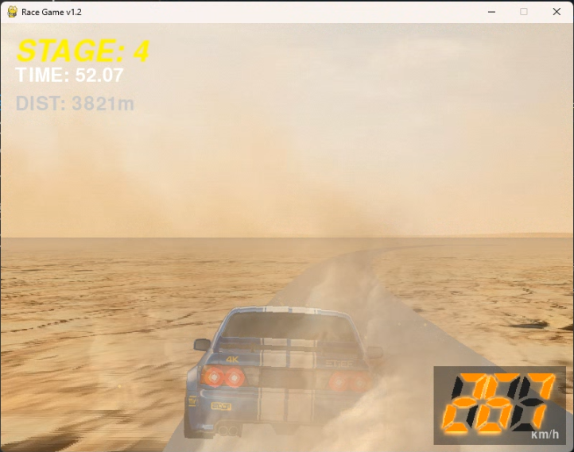

# Pseudo 3D Racing Game

A retro-style pseudo-3D racing game built with Python and Pygame.




## Features

- 6 stages with unique characteristics (curves, sand, wet roads, tunnels)
- Pseudo-3D graphics with perspective scrolling
- Digital speedometer and lap timer
- Ranking system (Top 5 scores saved)
- Gamepad support

## Requirements

- Python 3.8+
- Pygame 2.x
- [Git LFS](https://git-lfs.com/) — image and sound assets in `asset/` are stored with LFS

## Installation

```bash
git lfs install        # once per machine, before cloning
git clone https://github.com/masa7an/Racegame.git
cd Racegame
pip install pygame
```

If you cloned without Git LFS installed, run `git lfs pull` to fetch the assets.

> **Note:** The engine sound is fully included (`asset/engine_low/mid/high.wav`,
> procedurally generated — no third-party audio). If the files are missing for any
> reason, the game still runs fine with the engine sound disabled.

## How to Run

```bash
python main.py
```

Or double-click `run.bat` on Windows.

## Controls

| Action | Keyboard | Gamepad |
|--------|----------|---------|
| Accelerate | ↑ / W / Space | Button A |
| Brake | ↓ / S / B | Button B |
| Steer | ← → | D-Pad / Stick |

### Game Clear Screen
- **CONTINUE**: Enter / Space / C
- **EXIT**: Esc / E

## Credits

### Development
This game was created almost entirely by a non-engineer using **Antigravity** and **Gemini** AI tools.

### BGM
"Turbo Apex" — created by the author with [Suno](https://suno.com/).

## License

This project is for personal/educational use.
